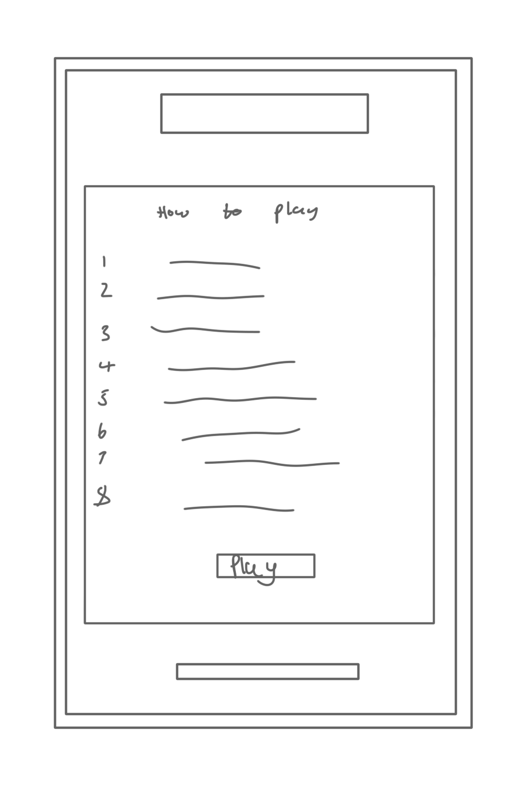
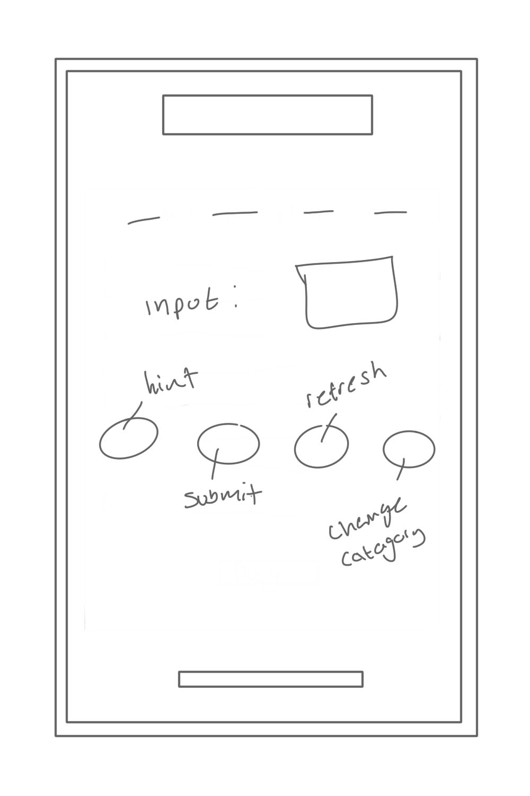
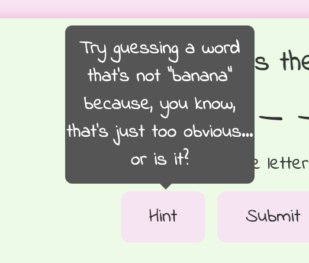
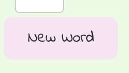
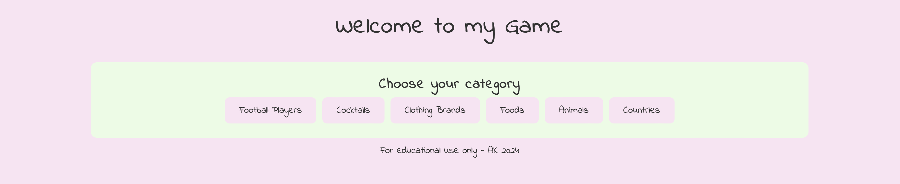
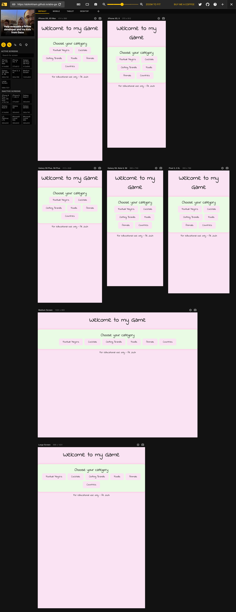
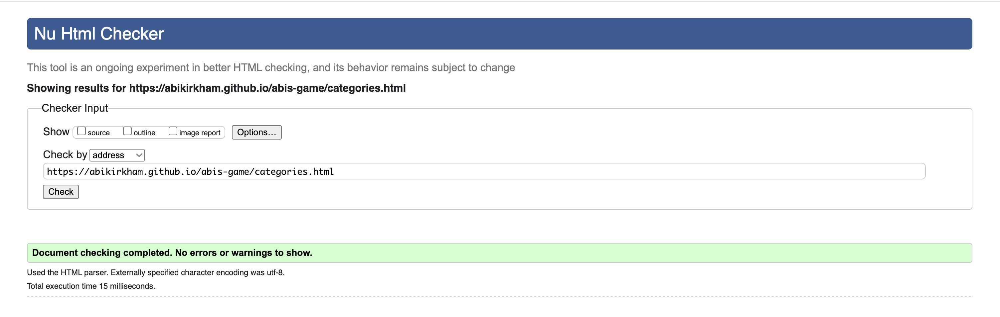
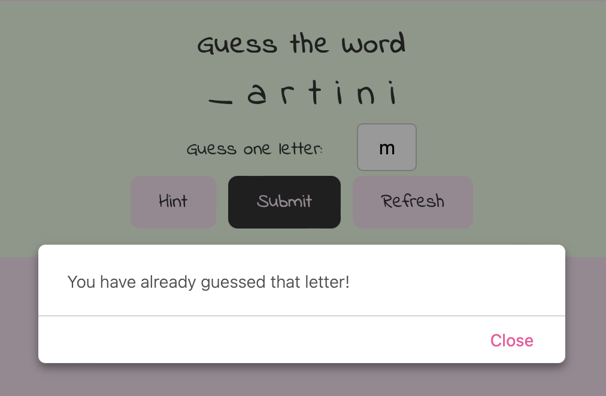

# Abi's Game

## Overview

Simple as is sounds, this is my game, it is a word guessing game. This will be slowly developed on to keep the brain stimulated.

## User Stories

1. **Start a New Game:** As a player, I want to start a new game easily so that I can begin guessing words right away.
2. **Guess Feedback:** As a player, I want the game to provide feedback on my guesses, indicating whether the guessed letter is in the word and revealing its position if correct.
3. **Incorrect Guess Tracking:** As a player, I want the game to keep track of my incorrect guesses, such as displaying them or deducting points.
4. **Hint Option:** As a player, I want the option to receive a hint if I'm stuck, providing me with a clue related to the word being a cocktail.
5. **Game End on Correct Guess:** As a player, I want the game to end when I correctly guess the word, congratulating me on my win.
6. **Play Multiple Rounds:** As a player, I want the ability to play multiple rounds without having to restart the entire game.
7. **Intuitive Navigation:** As a player, I want the game to be intuitive and easy to navigate, with clear instructions on how to play.

## Wireframes

Below are my wireframes, I love simpliciy and I wanted to carry that on through this game. You can see the plan and sturcture I have created to develop my game.





## Technologies Used

- [HTML:](https://en.wikipedia.org/wiki/HTML) Used for structuring the web pages.
- [CSS:](https://en.wikipedia.org/wiki/CSS) Used for styling the HTML documents.
- [JavaScript:](https://en.wikipedia.org/wiki/JavaScript) Used for implementing interactive features and game logic.
- [GitHub:](https://en.wikipedia.org/wiki/GitHub) Used for version control and deployment.
- [Gitpod](https://www.gitpod.io) / [Visual Studio Code](https://en.wikipedia.org/wiki/Visual_Studio) (IDE): Used for coding and managing the project.

## Features

- **Landing page:** Introduction to the project with a 'how to play' section and navigation to the game.


- **Game Page:** Displays the word guessing game interface for users to play with interactive features.


- **Header and Footer:** Consistent navigation and branding across pages.


- **Hint:** If the user is struggling to guess the word, I have included an extra function for the user to get a hint on one click.



- **Refresh:** Again, I have included an extra interaction for if the user wants a new game after guessing the correct word or find the current word too hard.



- **Catagories** Here I wanted a user to have mutliple choices to chose from to keep the guessing game more interesting. 


## Deployment

### Making a Local Clone to Create Project

1. Find the GitHub Repository.
2. Click the Code button.
3. Copy the link shown.
4. In Gitpod/Visual Studio Code, change the directory to the desired location.
5. Type `git clone`, and paste the link copied in step 3.
6. Press Enter to create the local clone.

### Updating Changes

- `git add <file>`: Add file(s) to the staging area.
- `git commit -m “commit message”`: Commit changes to the local repository.
- `git push`: Update committed code to the remote repository on GitHub.

### Deploying a GitHub Repository via GitHub Pages

1. Go to Repository Settings.
2. Scroll down to GitHub Pages section.
3. Under Source, select Main branch.
4. Click Save.
5. Wait for the site to be published at the provided link.

## Testing

- **Manual Testing:** Detailed testing process, including scenarios and outcomes. 


| Function | User Action | Outcome | Result |
|----------|-------------|---------|--------|
| Access webpage | Use this link | Homepage with how to play | Pass |
| CSS styles for hover | Hover over links (title and play button) | The links will change colour | Pass |
| Load game | Click play button | This will open the game | Pass |
| CSS styles for hover | Hover over hint, submit, and refresh button | The buttons will change colour | Pass |
| Letter input | Type in letter to the input box | Letter displays in box | Pass |
| Submit with correct letter | Once entered letter, click submit button | If letter correct, this will show on the dotted line in the correct position | Pass |
| Submit with incorrect letter | Once entered letter, click submit button | If letter incorrect, this will disappear | Pass |
| Submit with no input | Click enter without having a letter in the input | A pop-up will show with error message to say the user needs to enter a letter | Pass |
| Submit with letter already entered | Enter a letter in the input box which has already been guessed | A pop-up error message will show to say the letter has already been entered | Pass |
| Submit on final correct guess | User will enter the last letter which is correct | A pop-up message will show to say congrats they have guessed correctly | Pass |
| Refresh | User will click the refresh button when they want a new game | New game will load clearing guesses | Pass |
| Hint | User will click on the hint option when they are stuck | A pop-up box will hover over the hint box with a sarcastic clue. | Pass |
| Categories html | User clicks on 'PLAY' button on index.html | The page will load with matching css and hover boxes loading correctly | Pass |
| Selected category | User to Select a category | This will open there chosen category, can be proven by looking at html link | Pass |

#### View Category testing 

In the process of enhancing the game's functionality to include multiple categories, I made several adjustments to ensure a seamless user experience. Initially, the game solely revolved around guessing words related to cocktails. However, to personalise the game and provide more variety, I decided to incorporate additional categories such as football players and clothing brands.

To implement this feature, I first modified the data structure by renaming the constant from `words` to `categoriesWords` and expanded it to accommodate multiple categories. Each category now contains an array of words associated with it.

Next, I needed to update the game logic to select a random word from the user's chosen category. Previously, the code simply selected a random word from the single category list using `Math.random()`. However, with the help from the tutors at Code Institute and [SheCodes](https://www.shecodes.io/athena/27068-what-is-urlsearchparams-in-javascript#:~:text=question%20for%20FREE-,%5BJavaScript%5D%20%2D%20What%20is%20URLSearchParams%20in%20JavaScript%3F,modify%20and%20manipulate%20the%20URL.) in understanding URLSearchParams to allow me to introduce multiple categories, I used URL parameters to identify the selected category. This information is extracted from the URL using `URLSearchParams`, ensuring that the game knows which category the user has chosen.

Here's a code snippet illustrating the updated logic:

```javascript
const urlParams = new URLSearchParams(window.location.search);
const category = urlParams.get('category'); // Get category from URL parameter
const words = categoriesWords[category]; // Retrieve words array for selected category
let randomIndex = Math.floor(Math.random() * words.length); // Calculate random index within the words array
let selectedWord = words[randomIndex]; // Select a random word from the words array
```

I decided to split my game into two HTML pages for better organization. One page is for selecting categories, and the other is for playing the game. This separation makes the code easier to manage. When users click on a category button, it triggers the startGame function, which constructs a URL with the selected category as a parameter. I used the window.location.href method to redirect users to the game page with their chosen category. This setup improves the user experience and makes it easier to expand the game with more categories in the future. I found [W3Schools](https://www.w3schools.com/js/js_window_location.asp) helpful for understanding how to use window.location.

```html
<main>
        <div class="container">
            <h2>Choose your category</h2>
            <button  onclick="startGame('football')">Football Players</button>
            <button  onclick="startGame('cocktails')">Cocktails</button>
            <button  onclick="startGame('clothing')">Clothing Brands</button>
            <button  onclick="startGame('foods')">Foods</button>
            <button  onclick="startGame('animals')">Animals</button>
            <button  onclick="startGame('countries')">Countries</button>
        </div>
            </main>
    <footer>For educational use only - AK 2024</footer>
<script>
    function startGame(category) {
        // Construct the URL with the selected category as a parameter
        window.location.href = `game.html?category=${category}`;
    }
</script>
```

<details>
  <summary><b>Click to expand for more testing below:</b></summary>

- **Automated Testing:** Results from testing tools like [Lighthouse](https://chromewebstore.google.com/detail/lighthouse/blipmdconlkpinefehnmjammfjpmpbjk) for performance evaluation, and [Responsive Viewer](https://chromewebstore.google.com/detail/responsive-viewer/inmopeiepgfljkpkidclfgbgbmfcennb) for assessing screen size responsiveness, significantly improve the quality assurance process.

index.html


game.html


categories.html




- **Validator Testing:** Validation results from HTML and CSS validators. Utilising [W3C CSS Validator](https://jigsaw.w3.org/css-validator/) for CSS validation and [W3C Markup Validator](https://validator.w3.org/nu/) for HTML validation ensures thorough testing for any errors.

index.html


game.html


categories.html


style.css


- **Javascript Testing:** Using [JSHint](https://jshint.com) helps in identifying and rectifying JavaScript errors, ensuring code quality and reliability.

Javascript - game.js


</details>

## Bugs
1. Upon creation of this game, I have decided to add a few more personalish features I think will make this project better for the user. One of these funtions is the 'Hint' function. Initially I was having issues with the display of the next, I ran this code through validator services like jshint and in the terminal and the function was properly srtuctured and working as should. This meant there was an issue in my css code, I began trial and error and attempted to solve this issue myself, I had the elp from Code Institue Tutor support to help me under stand where the issue was. Below is the orginal css code for this function and where the error lies.

```css
/* Pop up styles */
.popup .popuptext::after {
    content: "";
    position: absolute;
    top: 100%;
    left: 50%;
    bottom: 125%; /* This was the error */
    border-width: 5px;
    border-style: solid;
    border-color: #555 transparent transparent transparent;
}

```

This was the issue is due to when using relative units, such as percentage, the maximum and minimum value are 100% and 0% (as the child can only be 100% of the parent element before it overflows). With using a value of 125% it was knocking it off the screen. For me, I decided to simply remove it and then add additional styles to the text itself on where I wanted to position the box.


```css
/* Pop up styles */
.popup .popuptext::after {
    content: "";
    position: absolute;
    top: 100%;
    left: 50%;
    border-width: 5px;
    border-style: solid;
    border-color: #555 transparent transparent transparent;
}
.popup .popuptext {
    visibility: hidden;
    width: 160px;
    background-color: #555;
    color: #fff;
    text-align: center;
    border-radius: 6px;
    padding: 8px 0;
    position: absolute;
    z-index: 1;
    left: 50%;
    margin-left: -190px; /* New style added for positioning of text box */
    margin-top: -80px; /* New style added for positioning of text box */
}
```

2. The issue with the guess the word function was not allowing the first letter of the word to be recognised or accepted as seen below:



This was because I had intially had the first letter as a captial and because I convert the input always to lowercase to ensure whatever the user inputs (capital or not) this will match the word BUT the first letter is not lowercase so it can never be guessed correctly since it is not possible to enter uppercase letters. I simply changed the first letter to lowercase as seen below.

```javascript
// Categories for user to chose
const categoriesWords = {
    football: [
        "ronaldo",
        "messi",
        "neymar",
        "mbappé",
        "salah",
        "lewandowski",
        "foden",
        "rooney",
        "kane",
        "haaland"
    ],}
```

## Credits
- [GeeksForGeeks - Word guessing game](https://www.geeksforgeeks.org/word-guessing-game-using-html-css-and-javascript/): This was the tutorial and basic infrastructure for my game. This taught me how to create a game allowing me to understand and recreate my own version with extra personalized features.
- [YouTube - CSS: Sticky Footer Tutorial](https://www.youtube.com/watch?v=JaC21cZnbl0): Tutorial for implementing a sticky footer using CSS.
- [SheCodes.io - Sticking Footer to the End of an HTML Page](https://www.shecodes.io/athena/4613-sticking-footer-to-the-end-of-an-html-page#:~:text=You%20can%20stick%20a%20footer,the%20footer%20in%20your%20CSS.): Additional methods for creating a sticky footer in HTML and CSS.
- [W3Schools - Window Alert Method](https://www.w3schools.com/jsref/met_win_alert.asp): Used the `alert()` method for displaying notifications.
- [W3Schools - JavaScript Popup Box](https://www.w3schools.com/howto/howto_js_popup.asp): Integration of JavaScript popup boxes for displaying information.
- [Mobirise Forums - Creating a Refresh Button for a Single Page](https://forums.mobirise.com/discussion/30640/create-a-refresh-button-for-just-one-page): Provided solutions for adding a refresh button to a single page.
- [FreeConvert.com - TIF to PNG Converter](https://www.freeconvert.com/tif-to-png/download): Utilized for converting TIF image files to PNG format for web optimization.
- [Mozilla Developer Network (MDN) - CSS Positioning](https://developer.mozilla.org/en-US/docs/Web/CSS/position#): Referred to for styles and correct positioning needed in the project.
- [TechSini - Multi Mockup](https://techsini.com/multi-mockup/index.php): Used for creating mockups.

