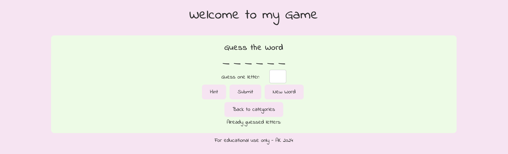

# Abi's Game

## Overview

Simple as is sounds, this is my game, it is a word guessing game. This will be slowly developed on to keep the brain stimulated.

## User Stories

1. **Start a New Game:** As a player, I want to start a new game easily so that I can begin guessing words right away.
2. **Guess Feedback:** As a player, I want the game to provide feedback on my guesses, indicating whether the guessed letter is in the word and revealing its position if correct.
3. **Incorrect Guess Tracking:** As a player, I want the game to keep track of my incorrect guesses, such as displaying them or deducting points.
4. **Hint Option:** As a player, I want the option to receive a hint if I'm stuck, providing me with a clue related to the word being a cocktail.
5. **Game End on Correct Guess:** As a player, I want the game to end when I correctly guess the word, congratulating me on my win.
6. **Play Multiple Rounds:** As a player, I want the ability to play multiple rounds without having to restart the entire game.
7. **Intuitive Navigation:** As a player, I want the game to be intuitive and easy to navigate, with clear instructions on how to play.

## Wireframes

## Technologies Used

- **HTML:** Used for structuring the web pages.
- **CSS:** Used for styling the HTML documents.
- **JavaScript:** Used for implementing interactive features and game logic.
- **GitHub:** Used for version control and deployment.
- **Gitpod/Visual Studio Code (IDE):** Used for coding and managing the project.

## Features

- **Landing page:** Introduction to the project with a 'how to play' section and navigation to the game.

- **Game Page:** Displays the word guessing game interface for users to play with interactive features.

- **Header and Footer:** Consistent navigation and branding across pages.

## Deployment

### Making a Local Clone to Create Project

1. Find the GitHub Repository.
2. Click the Code button.
3. Copy the link shown.
4. In Gitpod/Visual Studio Code, change the directory to the desired location.
5. Type `git clone`, and paste the link copied in step 3.
6. Press Enter to create the local clone.

### Updating Changes

- `git add <file>`: Add file(s) to the staging area.
- `git commit -m “commit message”`: Commit changes to the local repository.
- `git push`: Update committed code to the remote repository on GitHub.

### Deploying a GitHub Repository via GitHub Pages

1. Go to Repository Settings.
2. Scroll down to GitHub Pages section.
3. Under Source, select Main branch.
4. Click Save.
5. Wait for the site to be published at the provided link.

## Testing

- **Manual Testing:** Detailed testing process, including scenarios and outcomes. 

| Function | User Action | Outcome | Result |
|----------|-------------|---------|--------|
| Access webpage | Use this link | Homepage with how to play | Pass |
| CSS styles for hover | Hover over links (title and play button) | The links will change colour | Pass |
| Load game | Click play button | This will open the game | Pass |
| CSS styles for hover | Hover over hint, submit, and refresh button | The buttons will change colour | Pass |
| Letter input | Type in letter to the input box | Letter displays in box | Pass |
| Submit with correct letter | Once entered letter, click submit button | If letter correct, this will show on the dotted line in the correct position | Pass |
| Submit with incorrect letter | Once entered letter, click submit button | If letter incorrect, this will disappear | Pass |
| Submit with no input | Click enter without having a letter in the input | A pop-up will show with error message to say the user needs to enter a letter | Pass |
| Submit with letter already entered | Enter a letter in the input box which has already been guessed | A pop-up error message will show to say the letter has already been entered | Pass |
| Submit on final correct guess | User will enter the last letter which is correct | A pop-up message will show to say congrats they have guessed correctly | Pass |
| Refresh | User will click the refresh button when they want a new game | New game will load clearing guesses | Pass |
| Hint | User will click on the hint option when they are stuck | A pop-up box will hover over the hint box with a clue | Pass |

  
Click to expand for more testing below:

- **Automated Testing:** Results from testing tools like [Lighthouse](https://chromewebstore.google.com/detail/lighthouse/blipmdconlkpinefehnmjammfjpmpbjk) for performance evaluation, and [Responsive Viewer](https://chromewebstore.google.com/detail/responsive-viewer/inmopeiepgfljkpkidclfgbgbmfcennb) for assessing screen size responsiveness, significantly improve the quality assurance process.

index.html

game.html

- **Validator Testing:** Validation results from HTML and CSS validators. Utilising [W3C CSS Validator](https://jigsaw.w3.org/css-validator/) for CSS validation and [W3C Markup Validator](https://validator.w3.org/nu/) for HTML validation ensures thorough testing for any errors.

index.html

game.html

style.css

- **Javascript Testing:** Using [JSHint](https://jshint.com) helps in identifying and rectifying JavaScript errors, ensuring code quality and reliability.

Javascript - game.js

## Bugs

hint option not working - ask tutors and put results here

## Credits

- https://www.youtube.com/watch?v=JaC21cZnbl0
- https://www.shecodes.io/athena/4613-sticking-footer-to-the-end-of-an-html-page#:~:text=You%20can%20stick%20a%20footer,the%20footer%20in%20your%20CSS.
- https://www.w3schools.com/jsref/met_win_alert.asp
- https://www.w3schools.com/howto/howto_js_popup.asp
- https://forums.mobirise.com/discussion/30640/create-a-refresh-button-for-just-one-page

